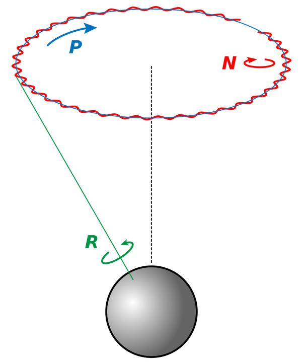

*Réponse publiée [sur Quora](https://fr.quora.com/Quest-ce-qui-modifie-langle-dinclinaison-de-la-terre/answer/Dr-Goulu)*

1. la [Précession](w:Précession_des_équinoxes), d'une période de 25'800 ans, mais l'angle par rapport à l'écliptique n'est pas vraiment modifié, il "fait juste un tour"
2. la [Nutation](w:), qui est une oscillation de l'axe de rotation de la Terre pouvant aller jusqu'à plus ou moins 17,2″ (secondes d'arc) en longitude et à plus ou moins 9,2" en obliquité avec une période de 18,6 ans

(précession P et nutation N de l'axe R)

On peut y ajouter [l'obliquité du plan de l'écliptique](w:en:Ecliptic), qui varie avec une période de l'ordre de 43000 ans. Ca ne change pas vraiment l'axe non plus, mais les [Pôle de l'écliptique](w:) par rapport auxquels on mesure l'angle d'inclinaison.

Si vous vouliez savoir ce qui cause ces oscillations et variation, c'est tout ce qui ne tourne pas rond :

- la Terre qui n'est pas une sphère parfaite
- les orbites des planètes qui ne sont pas des cercles mais des ellipses
- Jupiter qui est si massif qu'il déplace le centre de gravité du système solaire (plus que les autres planètes)

mais en même temps, ce serait pire si la Lune n'était pas là pour stabiliser le moment cinétique Terre / Lune, qui correspond à celui d'une planète BEAUCOUP plus grosse que la Terre seule.
