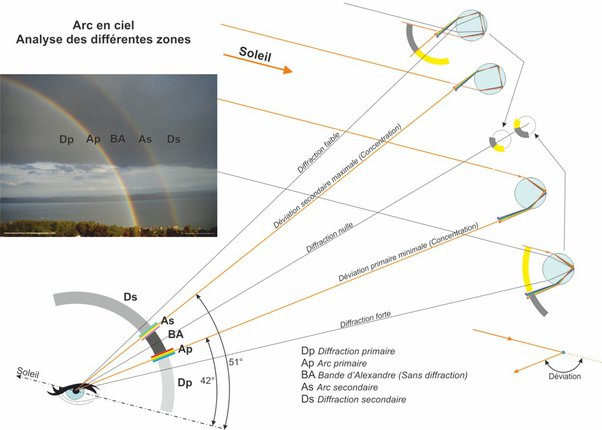

*Réponse publiée [sur Quora](https://fr.quora.com/A-quelle-%C3%A9poque-le-ph%C3%A9nom%C3%A8ne-de-larc-en-ciel-a-t-il-%C3%A9t%C3%A9-compris/answer/Dr-Goulu)*

Comme souvent en sciences, la compréhension d'un phénomène est progressive et prend du temps, en l'occurrence plus d'un millénaire.

[Arc-en-ciel - Historique de la découverte de sa formation — Wikipédia](w:Arc-en-ciel) mentionne que Pline L'Ancien, né en 23 et mort en 79 (lors de l'éruption du Vésuve qui détruisit Pompei) écrivait déjà :

> **Il est évident que** le rayon solaire entré dans une nuée concave est repoussé vers le soleil et **réfracté**, et que la variété des couleurs est due au mélange du nuage, de l'air et du feu.

J'ai mis en gras "il est évident que", la pire locution qu'on puisse trouver dans un énoncé scientifique, et la mention pourtant correcte de la [Réfraction](w:), qui n'a été étudiée sérieusement qu'après Pline par [Ptolémée](w:Claude_Ptolémée) (~100 - 168). Il est probable que le phénomène de décomposition des couleurs de la lumière solaire était connu depuis l'invention du [verre transparent](w:Histoire_du_verre), au 4ème ou 3ème siècle avant JC.

Le rôle de la réfraction de la lumière sur des gouttelettes d'eau est à nouveau suspecté au début du 14ème siècle par les savants persans [Qotb al-Din Chirazi](w:) et [Kamāl al-Dīn al-Fārisī](w:), et en Europe par [Dietrich von Freiberg](w:).

[René Descartes](w:) redécouvre le principe de la loi de la réfraction en 1637. et publie le dessin ci-dessous en 1837 dans L'appendice *Les météores* (discours huitième sur les arcs-en-ciel) de son [*Discours de la méthode pour bien conduire sa raison et chercher la vérité dans les sciences*](w:Discours_de_la_méthode)*, qui montre même l'arc secondaire :*

Presque aussi bien que l'illustration de la wikipedia :

