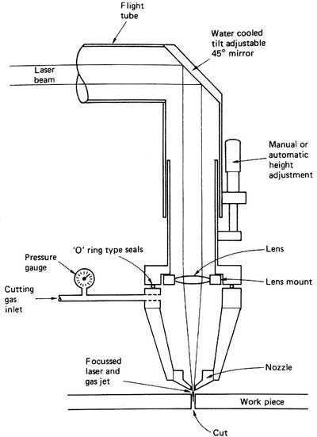

*Réponse publiée [sur Quora](https://fr.quora.com/Si-on-utilise-un-laser-très-puissant-sur-un-miroir-est-ce-quil-va-casser-ou-est-ce-que-le-laser-sera-réfléchi/answer/Dr-Goulu)*

Oui c'est ça. Je connais les [Laser au CO2](w:Laser_au_dioxyde_de_carbone) qui servent à la découpe laser de tôle, typiquement de 4kW de puissance. L'article [Laser cutting - Wikipedia](w:en:Laser_cutting) montre cette figure (que je cherchais pour ma réponse…) Et effectivement, si des fumées remontent sur la lentille depuis la zone de coupe, elle pète, d'où l'injection d'un gaz neutre pour empêcher ça.

