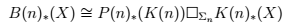

*Réponse publiée [sur Quora](https://fr.quora.com/Quelle-est-selon-vous-la-branche-la-plus-abstraite-des-maths/answer/Dr-Goulu)*

Je vote pour la [Topologie algébrique](w:) vu que je n'ai strictement rien compris à l'équation gravée sur la tombe d'un ami de la famille :

Pourtant j'ai essayé.

[L'abstraction mathématique gravée dans le marbre - Pourquoi Comment Combien](https://www.drgoulu.com/2016/12/02/abstraction-mathematique-gravee-dans-le-marbre/#.XgZ1BUdsOCo)
