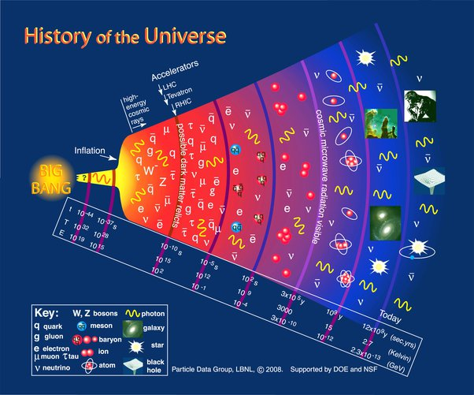

*Réponse publiée [sur Quora](https://fr.quora.com/Y-a-t-il-une-chance-sur-sept-que-l-univers-ait-commenc%C3%A9-un-lundi/answer/Dr-Goulu)*

J'aime bien cette question, parce que je me pose depuis longtemps la question sous-jacente : est-ce que la seconde (ou l'heure, ou le jour ou la semaine) avaient la même durée près du Big Bang ?

Ou autrement dit : quelle pendule pouvait mesurer le temps à cette période ?

La définition actuelle de la [seconde](w:Seconde_(temps))est :

> durée de 9 192 631 770 périodes de la radiation correspondant à la transition entre les deux niveaux hyperfins de l’état fondamental de l’atome de césium 133

Mais quand il n'y avait pas d'atome de césium 133 ? (qui a été formé dans des étoiles des millions d'années plus tard ?

Et quand l'univers était si chaud qu'il n'y avait aucune transition entre des niveaux atomiques émettant des photons de longueur d'onde précise ?

Et quand l'Univers était si dense que les photons n'arrivaient pas à osciller une seule fois avant d'interagir avec une autre particule ?

Quand on voit l'échelle des temps dans la figure ci-dessus, on se dit qu'il s'est peut être passé plus de trucs (= interactions) dans la "première seconde" que dans les 13.8 milliards d'années ( moins une seconde…) qui ont suivi.

Et que si on mesurait le temps en log(secondes) tout serait tellement plus lisse …

Ah, et oh ! Il n'y aurait plus de Big Bang : il serait étalé depuis $\lim\limits_{t \to 0} log(t) = -\infty$

Dans ce cas désolé, l’univers n’a jamais commencé …
