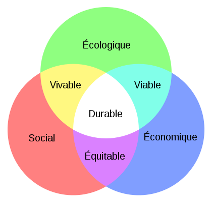

*Réponse publiée [sur Quora](https://fr.quora.com/Le-capitalisme-est-il-compatible-avec-l%C3%A9cologie/answer/Dr-Goulu)*

le capitalisme n'est que la forme de l'économie, qui est l'un des trois piliers de la [Durabilité](w:) avec l'écologie et le social, souvent représentés ainsi :

Votre question revient à savoir s'il existe réellement une intersection "viable", voire "durable".

A mon humble avis il manque une dimension importante dans ce schéma : la population, que l'on retrouve dans l'[Équation de Kaya](w:) qui a 4 facteurs au lieu de 3. J'ai l'impression que les 3 piliers s'écartent lorsque la population augmente …

Quand on était quelques millions, ces intersections existaient certainement. A plusieurs milliards, faut voir …

[Développement Durable et Equation de Kaya - Pourquoi Comment Combien](/2009/06/06/developpement-durable-et-equation-de-kaya/)

Si vous avez une proposition pour remplacer le capitalisme par un système qui maintient le pilier économique avec ses jolies intersections sans envoyer des millions de gens en rééducation par le travail et les faire mourir de faim lors d'un Grand Bond en Avant, on est preneurs.
