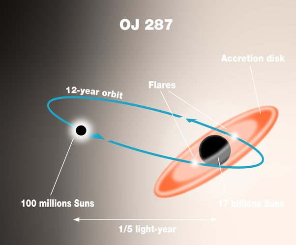

*Réponse publiée [sur Quora](https://fr.quora.com/Un-trou-noir-peut-il-absorber-un-autre-trou-noir/answer/Dr-Goulu)*

Un trou noir n'aspire rien du tout. A grande distance il déforme l'espace comme le ferait une étoile de même masse, et "attire" donc n'importe quelle autre objet, trous noirs compris.

Mais les trous noirs sont si petits qu'ils n'ont aucune chance d'entrer en collision frontale. Il se mettent en orbite l'un autour de l'autre en formant un [Trou noir binaire](w:) qui émet des ondes gravitationnelles, ce qui rapproche peu à peu les deux objets jusqu'à ce qu'ils fusionnent.

C'est arrivé à [GW150914](w:), le premier événement de ce genre mesuré par LIGO

> L’analyse du signal au travers du décalage vers le rouge présumé a suggéré qu’il a été produit par la fusion de deux [trous noirs](w:Trou_noir) avec des **masses respectives de 36 et 29 fois celle du Soleil**, conduisant à un trou noir post-fusion de 62 masses solaires. La différence d'énergie de **3 masses solaires a été rayonnée sous forme d’ondes gravitationnelles**, en accord avec l’[équivalence masse–énergie](w:E=mc2).
>
>
>
> Le pic d’énergie rayonnée par l’onde gravitationnelle, d’une puissance d’environ 3,6×10^49 W était supérieur à la puissance lumineuse rayonnée par toutes les étoiles de l’[univers observable](w:). [Kip Thorne](w:) a indiqué : « La puissance totale libérée dans les ondes gravitationnelles pendant la brève collision était **cinquante fois plus grande que toute la puissance diffusée par toutes les étoiles de l’univers mises ensemble.** »
>
>
>
> Pendant la durée de 0,2 s du signal détectable, la vitesse tangentielle relative (orbitale) des trous noirs a augmenté de 30 % à 60 % de la [vitesse de la lumière](w:). La **fréquence orbitale de 75 Hz** (la moitié de la fréquence de l’onde gravitationnelle) signifie que les objets orbitaient l’un autour de l’autre à une distance de seulement 350 km avant qu’ils ne fusionnent.

Vous arrivez à imaginer deux choses 30 fois plus massives que le Soleil qui se tournent autour 75 fois par seconde à 350 km de distance ? Bravo !

Mais mon trou noir binaire préféré reste [OJ 287](w:). Un trou noir de 100 millions de masses solaires tourne en 12 ans (moins quelques jours à chaque tour) autour d'un de 17 milliards de masses solaires, le tout à peine plus grand que notre système solaire. Quand le "petit" trou noir traverse le disque d'accrétion du grand, il émet des flashes visibles jusqu'ici, à 3.5 milliards d'année lumière

