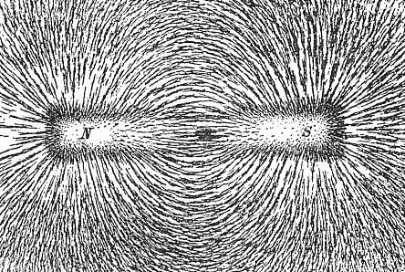

*Réponse publiée [sur Quora](https://fr.quora.com/Comment-fonctionnent-les-aimants/answer/Dr-Goulu)*

C'est magique hein ? Et bien la réponse risque de vous étonner.

Il n'y a aucune énergie qui attire la limaille de fer. Elle tombe dans un trou du champ magnétique creusé par l'aimant exactement comme elle tombe dans le trou du champ gravitationnel creusé par la Terre.

Simplement, l'aimant a un [Moment magnétique](w:) comme il a une masse, et pourrait avoir en plus une charge électrique qui creuse le champ électrostatique.

Les différences c'est que:

- la gravitation n'implique que des masses positives, donc l'idée qu'elles "creusent" le champ gravitationnel est assez claire
- les charges électrostatiques peuvent être positives ou négatives, alors c'est plus compliqué, mais vous pouvez imaginer que les négatives creusent le champ et les positives y font des bosses. Des charges qui se promènent tendent à aplanir les bosses et les creux (les bosses positives tombent dans les trous négatifs et vice-versa, alors que les bosses repoussent les bosses et les trous repoussent les trous …)
- les aimants ont à la fois des pôles "nord" et "sud" (on ne connaît pas de [Monopôles magnétiques](w:Monopôle_magnétique) ), donc ils sont à la fois attirés et repoussés par les bosses et les creux du champ magnétique selon la même règle que ci-dessus : aplanir le champ.

Là où ça se corse, c'est que certains matériaux n'ont pas de moment magnétique à eux, mais en acquièrent un quand on les met dans un champ magnétique. Votre limaille est f[erromagnétique](w:Ferromagnétisme) : chaque particule devient un aimant qui "inverse la pente" du champ où il se trouve (pour l'aplanir…) : il se forme un pôle nord du côté du pôle sud de l'aimant voisin (ou d'une particule de limaille voisine déjà aimantée), et un pôle sud du côté du pôle nord. Total : la limaille s'oriente en une chaîne nord-sud-nord-sud-nord-sud pour essayer de lier le pole nord au sud de l'aimant, tout en repoussant les autres limailles à côté si leurs poles nord/sud correspondent, ce qui fait ces jolies figures

Plus fort encore, certains matériaux sont [Diamagnétiques](w:Diamagnétisme) : ils s'aimantent "dans le sens de la pente", ce qui fait qu'ils font un pôle nord du côté nord de l'aimant, et un sud du côté sud. Total : il repoussent l'aimant (= se font repousser par lui) au point de planer au dessus :

Et là je vous ressors le truc qui tue : pas besoin d'énergie ! Cette plaque de carbone pyrolytique peut voler au dessus des aimants indéfiniment. Mais ce n'est pas un mouvement perpétuel, parce qu'il n'y a pas de mouvement ! C'est seulement quand quelque chose bouge que l'[Énergie](w:) joue un rôle. Pour une [Force](w:Force_(physique)) statique, pas besoin d'énergie.

D'ailleurs, quand vous posez un objet sur une table, il reste là sans consommer d'énergie, et pourtant il ne touche pas vraiment la table : les électrons des atomes de la surface de la table repoussent les électrons de la surface inférieure de votre objet . Et heureusement, sinon votre objet se souderait à la table…

Alors, pourquoi trouvez vous des aimants qui se repoussent plus étonnants qu'un objet posé sur une table ? Il n'y a aucune raison, c'est très similaire.

Mais vous allez me dire que quand vous lâchez une bille d'acier, elle bouge très vite vers l'aimant, encore plus vite que si vous la laissez tomber en fait, alors que là il y a du mouvement, alors qui fournit l'énergie cinétique de la bille ?

Ben, puisqu'elle était en dehors du trou (gravitationnel ou magnétique), elle avait une énergie potentielle par rapport au fond du trou, et c'est cette énergie potentielle qui est convertie en énergie cinétique quand elle tombe dans le trou. D'ailleurs c'est vous qui allez devoir dépenser de l'énergie pour ressortir la bille du trou, gravitationnel ou magnétique .

Pour finir rapidement:

- Ce qui précède concerne en fait la [Magnétostatique](w:), qui est au magnétisme ce que l'électrostatique est à l'électricité : le cas ultra simple ou rien ne bouge
- Mais en fait, Faraday et Maxwell se sont aperçus que le magnétisme et l'électricité étaient liés et ont développé la théorie de l'[Électromagnétisme](w:) qui unifie les deux, et explique les ondes, et la lumière, et qu'en fait il n'y a besoin que d'un seul [Champ électromagnétique](w:) au lieu des deux susmentionnés.
- Le [Photon](w:) est le photon est la [particule médiatrice](w:Boson_de_jauge) de l’[interaction électromagnétique](w:). Elle correspond à un transfert d'énergie par rayonnement électromagnétique. C'est pour la découverte de ceci qu'Albert Einstein a reçu le prix Nobel en 1921, pas pour la relativité !
Mais pour la relativité il s'est beaucoup inspiré des travaux de Maxwell sur le champ électromagnétique, et son champ gravitationnel "unifie" l'espace et le temps (un tout petit peu) comme Maxwell a unifié magnétisme et électrostatique. Donc historiquement le champ "le plus simple" ci-dessus est celui qui a été défini proprement en dernier.
- L'[Intensité de champ magnétique](w:) se mesure en Tesla. Le calcul de la force (en Newton) magnétique qui attire un objet est TRES compliqué, car il dépend des caractéristiques du matériau, de sa taille, de sa forme. Il n'existe des formules que pour des cas tout simples et approximatifs. En pratique on doit avoir recours à des logiciels de calculs par éléments finis.
- le [Magnéton](w:) n'est pas une particule, c'est un mot qui peut désigner plusieurs choses comme le moment magnétique de l'électron ou un [Monopôle magnétique](w:).
