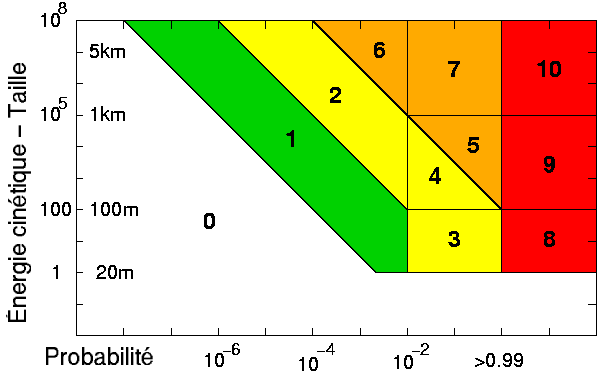

*Réponse publiée [sur Quora](https://fr.quora.com/%C3%80-partir-de-quelle-taille-un-ast%C3%A9ro%C3%AFde-serait-dangereux-sil-s%C3%A9crase-sur-la-Terre/answer/Dr-Goulu)*

L'[Échelle de Turin](w:) vous dit tout ça :

les niveaux 1 à 7 correspondent à des niveaux d'alerte avant la collision, les niveaux 8 à à 10 correspondent au niveau de destruction en cas de collision.

- **Niveau 8** : collision certaine capable de provoquer une destruction localisée. Un tel événement se produit tous les 50 à 1 000 ans en moyenne.
- **Niveau 9** : collision certaine avec destruction d'une région. Un tel événement se produit tous les 1 000 à 100 000 ans en moyenne.
- **Niveau 10** : collision certaine entraînant une catastrophe climatique globale pouvant menacer l'avenir de l'humanité. Un tel événement se produit moins d'une fois tous les 100 000 ans en moyenne.

L'échelle "énergie cinétique" est graduée en [Mégatonnes de TNT](w:Mégatonne), donc vous voyez qu'à partir d'une taille de 20 mètres, un astéroïde pourrait faire de gros dégâts à une ville, mais s'il tombe dans l'océan ça ne tuera que quelques poissons…

En 2013 le [Superbolide de Tcheliabinsk](w:) qui avait fait des blessés et dégâts faisait environ 15m, et il était heureusement tombé à côté de la ville.

En fait les scientifiques qui ont adopté l'échelle de Turin en 1999 sont un peu frustrés, parce que depuis il n'y a eu que quelques alertes niveau 1, et une seule fois une 2, puis 4 pour le fameux [(99942) Apophis](w:) qui est ensuite retombé à 0.

Alors ils ont inventé L'[Échelle de Palerme](w:) qui mesure plus finement le risque de collision, comme ça ils peuvent s'occuper en faisant des listes mises à jour en temps réel comme [Sentry: Earth Impact Monitoring](https://cneos.jpl.nasa.gov/sentry/) …

[Risques météoritiques - Pourquoi Comment Combien](https://www.drgoulu.com/2012/01/28/risques-meteoritiques/)
