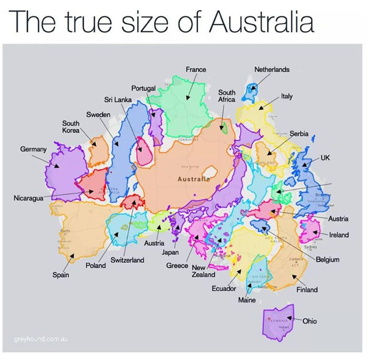

*Réponse publiée [sur Quora](https://fr.quora.com/Comment-lAustralie-a-t-elle-pu-devenir-un-pays-riche-alors-quelle-subit-r%C3%A9guli%C3%A8rement-des-catastrophes-naturelles/answer/Dr-Goulu)*

Les récents incendies ont brûlé l'équivalent de la surface de la Belgique… Vous la voyez la Belgique là ?

Ramenées à la taille du pays, les catastrophes naturelles ne sont pas pires qu'ailleurs…

Un ami australien me disait deux choses :

1. "L'Australie a une économie du Tiers-Monde avec une population instruite." C'est un peu brutal, mais il voulait dire que l'Australie vit de l'exportation de matières premières et produits agricoles, pas d'industrie à valeur ajoutée. Je ne connais aucun produit ou service courant "made in Australia", (à part la Vegemite… ) et vous ?
2. "L'erreur, ça a été de coloniser tout le continent". Ca coûte affreusement cher en infrastructure alors que toute la population (25 millions d'habitants) aurait tenu facilement dans une petite zone …
