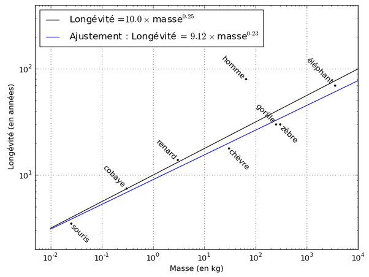

*Réponse publiée [sur Quora](https://fr.quora.com/La-dur%C3%A9e-de-vie-dun-%C3%AAtre-vivant-est-elle-li%C3%A9e-%C3%A0-sa-taille/answer/Dr-Goulu)*

Oui. La [Loi de Kleiber](w:) énonce que pour la majorité des vertébrés supérieurs, le [métabolisme](w:Métabolisme_basal) est proportionnel à la masse corporelle élevée à la puissance ¾.

En partant de l'idée que le nombre de pulsations cardiaques pendant une vie est environ le même, on en tire que la [Longévité](w:) est proportionnelle à la masse à la puissance 1/4. En pratique, les mesures montrent plutôt un exposant 0.23.

Vous voyez que l'espérance de vie des humains (proche de 80 ans) est plus du double de la prédiction à ~30 ans.

Merci qui ? Merci la médecine moderne !
