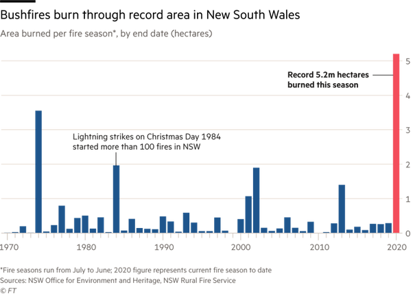

*Réponse publiée [sur Quora](https://fr.quora.com/Pourquoi-si-peu-d-int%C3%A9r%C3%AAt-pour-l-Australie-alors-que-c-est-une-catastrophe-mondiale/answer/Dr-Goulu)*

N'exagérons rien.

En nombre de morts on est très loin dans la [Liste des catastrophes naturelles les plus meurtrières depuis l'Antiquité](w:)

Et en hectares détruits c'est en effet un nouveau record, mais on ne voit pas clairement de tendance à la hausse:

Source : [Article du Financial Times](https://www.ft.com/content/c068339e-3c55-11ea-b232-000f4477fbca)

Bref, bien qu'archi convaincu du réchauffement climatique, je ne suis pas sûr qu'on puisse lui mettre ça sur le dos si facilement.
