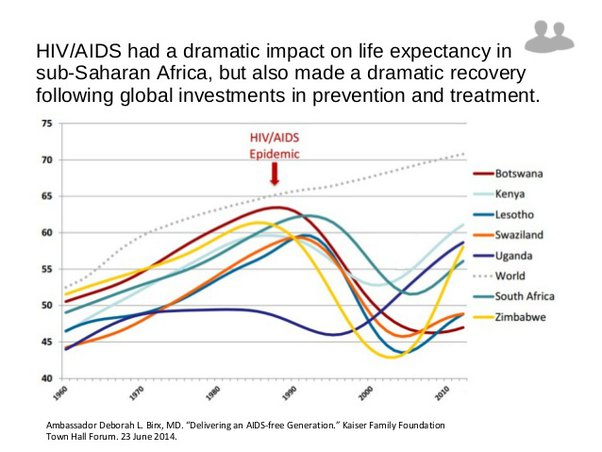

*Réponse publiée [sur Quora](https://fr.quora.com/La-durée-de-vie-dun-être-vivant-est-elle-liée-à-sa-taille/answer/Dr-Goulu)*

Oui, l'épidémie de SIDA est presque un mauvais souvenir, un peu comme les épidémies de peste ou de variole …

