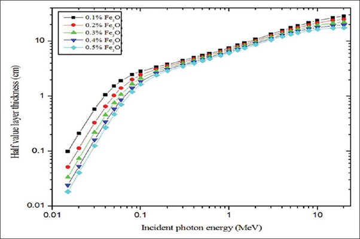

*Réponse publiée [sur Quora](https://fr.quora.com/Quels-matériaux-offrent-la-meilleure-protection-contre-les-radiations-cosmiques/answer/Dr-Goulu)*

je ne sais pas ce que sont les "hautes radiations". Le [Rayonnement ionisant](w:) peut être composé de particules alpha (= noyaux d'helium 4) très vite arrêté par n'importe quoi, de particules beta (électrons et positons) vite arrêtés dans des matériaux conducteurs, de rayons X et gamma qui sont des photons, et de neutrons.

L'[Eau lourde](w:) est utilisée comme modérateur de neutrons car elle absorbe MOINS de neutrons que l'eau normale. (et les neutrons absorbés par le Deuterium produisent du [Tritium](w:), et le militaires aimaient bien ça avant de trouver mieux…

D'après wikipedia le [Baryum](w:) absorbe surtout les X et les gamma.

En fait les "couches de demi atténuation" sont en général déterminées sous forme de courbes en fonction de l'énergie des photons :

