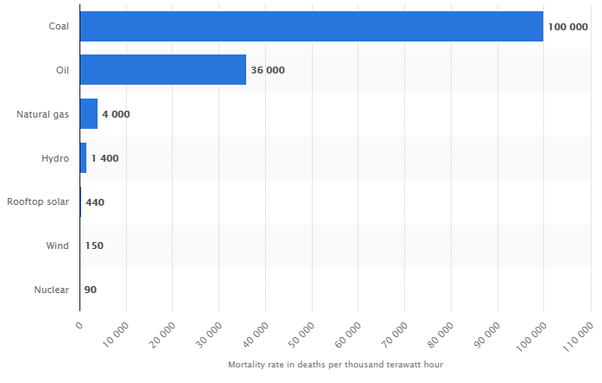

*Réponse publiée [sur Quora](https://fr.quora.com/Comment-r%C3%A9duire-le-risque-de-production-d%C3%A9lectricit%C3%A9-dans-les-centrales-nucl%C3%A9aires/answer/Dr-Goulu)*

En général on veut plutôt augmenter au maximum le "risque de production" de l'électricité …. Ca s'appelle le [Facteur de charge](w:Facteur_de_charge_(électricité)) .

Mais parfois on doit arrêter la centrale pour l'entretenir, la recharger en combustible ou la moderniser, par exemple à la suite d'un accident dont on a tiré les leçons.

Grâce à ça, le nucléaire est objectivement la source d'électricité qui fait le moins de morts par kWh produits[[1]](#esvZM)

Le moyen de réduire encore ce nombre est de ne plus construire de centrales nucléaires du tout, comme ça les gens qui tombent en installant des panneaux solaires ou des éoliennes pourront continuer à le faire sans nous déranger.

Notes de bas de page

[[1]](#cite-esvZM)[Le nucléaire, la source d’énergie la plus sûre](https://www.contrepoints.org/2017/08/04/296088-nucleaire-source-denergie-plus-sure)
