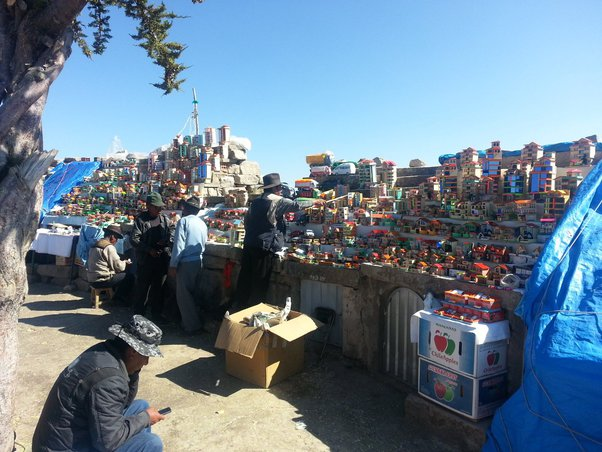

*Réponse publiée [sur Quora](https://fr.quora.com/Est-il-vraiment-juste-de-prier-Dieu-pour-plus-d-argent-ou-richesses-si-on-mange-%C3%A0-tous-les-jours-peut-on-demander-%C3%A0-Dieu-des-choses-mat%C3%A9rielles/answer/Dr-Goulu)*

Sur la colline qui surplombe [Copacabana en Bolivie](w:Copacabana_(Bolivie)) se trouve (je crois) le plus haut marché aux jouets du monde (4000m)

On y trouve des modèles réduits de voitures, de maisons, des liasses de billets de monopoly, des petites valises qui symbolisent un départ pour l'Europe…

Les gens viennent de loin pour acheter ces objets et les déposer aux pieds d'une statue de la Vierge qui surplombe le lac Titicaca, avec une prière pour obtenir l'objet de leurs rêves, en vraie grandeur.

A la fin de la journée, la statue est totalement submergée de bricoles multicolores. Je suspecte fortement les marchands de recycler les cadeaux la nuit pour la journée suivante…

La Sainte Vierge doit certainement tirer quelques gagnants au sort, puisque certains boliviens ont une voiture…
