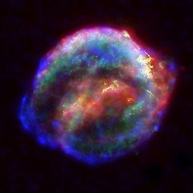
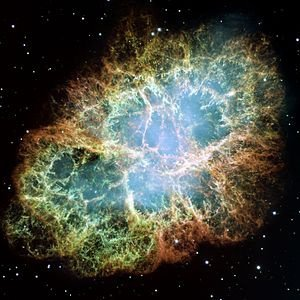

*Réponse publiée [sur Quora](https://fr.quora.com/Lexplosion-de-létoile-Bételgeuse-pourrait-elle-avoir-des-conséquences-sur-la-terre/answer/Dr-Goulu)*

oui, après une supernova il reste éventuellement une étoile à neutrons, un pulsar ou un trou noir, entouré par un type de [nébuleuse](w:) appelé [rémanent de supernova](w:). C'est très beau :

rémanent de SN 1604 :

rémanent de SN 1054:

en passant on ne tient pas compte du temps de parcours de la lumière pour baptiser les SN : SN1604 a eu lieu dans notre présent en 1604, SN1054 en 1054 et Bételgeuse sera SN 2xxx …
