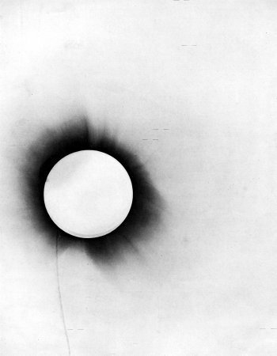

*Réponse publiée [sur Quora](https://fr.quora.com/La-flexion-de-la-lumi%C3%A8re-mesur%C3%A9e-par-Eddington-aurait-elle-pu-%C3%AAtre-due-%C3%A0-la-r%C3%A9fraction-de-latmosph%C3%A8re-solaire-plut%C3%B4t-qu%C3%A0-la-gravit%C3%A9/answer/Dr-Goulu)*

La réfraction dévie la lumière d'un angle variable en fonction de longueur d'onde provoquant une [dispersion](w:Dispersion_(mécanique_ondulatoire)) de la[https://fr.m.wikipedia.org/wiki/Dispersion_(mécanique_ondulatoire)?wprov=sfla1](w:Dispersion_(mécanique_ondulatoire))couleur.

Donc voyons la photo d'époque :

Bon, elle est en noir-blanc, mais les étoiles apparaissent comme de petits segments horizontaux bien nets : pas de flou des étoiles proches du soleil, donc pas de réfraction.

Idem pour les [Lentille gravitationnelle](w:)photographiées par Hubble et autres téléscopes modernes équipés de spectroscope : les masses dévient la lumière independemment de la longueur d'onde. Inexplicable en optique, et parfaitement cohérent en relativité.

Cela dit, Eddington lui même avait envisagé que son expérience soit perturbée par la réfraction et avait publié ses calculs dans Nature, montrant que s'il existait, cet effet serait négligeable. (voir [The Deflection of Light during a Solar Eclipse](https://www.nature.com/articles/104372c0))
