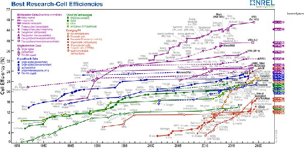

*Réponse publiée [sur Quora](https://fr.quora.com/La-puissance-des-panneaux-semblent-augmenter-r%C3%A9guli%C3%A8rement-A-quand-selon-vous-1KWC-pour-1m2/answer/Dr-Goulu)*

[Best Research-Cell Efficiency Chart](https://www.nrel.gov/pv/cell-efficiency.html) publie régulièrement une carte des rendements obtenus en laboratoire, voici celle de 2020:

On voit que les rendements n'augmentent pas "régulièrement" mais plutôt par bonds technologiques (les couleurs)

(Attention aussi : les mesures en laboratoire donnent des résultats meilleurs que dans les conditions d'utilisation réelles : [Comment on mesure le rendement des cellules solaires - Pourquoi Comment Combien](/2010/05/09/comment-on-mesure-le-rendement-des-cellules-solaires/))

Actuellement, les meilleures [cellules photovoltaïques multijonction](w:Cellule_photovoltaïque) frisent les 48% mais elles sont extrêmement chères, réservées au spatial pour l'instant.

En extrapolant naïvement, il a fallu 45 ans pour passer de 22% à 48%, donc on a gagné moins de 0.6% par an, donc il nous faut encore 86 ans pour atteindre les 100% correspondant à 1 kWc / m2

Mais en tant qu'adepte du [Principe de Pareto](w:), j'aurais tendance à dire qu'il faudra plus longtemps, à moins qu'on triche avec des [Panneau photovoltaïques à concentration](w:Panneau_photovoltaïque_à_concentration).
