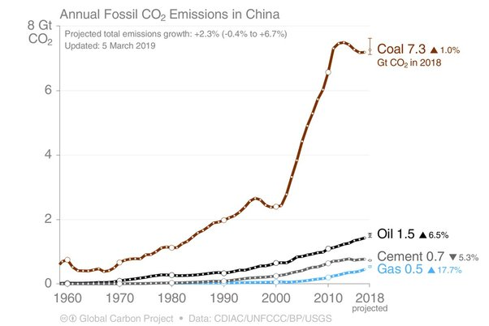

*Réponse publiée [sur Quora](https://fr.quora.com/Une-politique-de-lenfant-unique-peut-elle-sauver-le-climat-mondial-et-lhumanité/answer/Dr-Goulu)*

Dans le cas particulier ça leur a permis de freiner la croissance démographique induite par l'augmentation de l'espérance de vie, de développer une des plus fortes croissances économiques du monde, et de dégager 10 x plus de CO2 qu'avant :

Donc pas sur que ce soit un bon exemple pour "sauver le climat mondial", bien que personnellement je sois très content pour eux.
