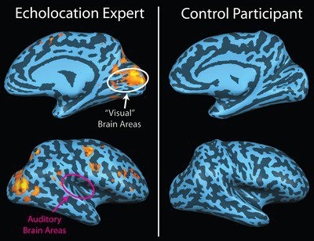

*Réponse publiée [sur Quora](https://fr.quora.com/Comment-le-cerveau-interpr%C3%A8te-les-sens-dont-surtout-la-vision/answer/Dr-Goulu)*

Une zone spécifique du cerveau, le [Cortex visuel](w:), traite les informations provenant des nerfs optiques. Il est divisé en une multitude de sous-régions fonctionnelles (V1, V2, V3, V4, MT, etc.) qui traitent les multiples propriétés ce ces informations (formes, couleurs, mouvements, etc.)

La destruction de certaines zones par un accident ou un AVC par exemple cause des les [agnosies](w:Agnosie) visuelles spécifiques. Par exemple des lésions de la zone V4 rendent le patient « aveugle » aux couleurs, c'est-à-dire [achromate](w:Achromatopsie) mais le reste de sa vision est parfaitement normale. D'autres zones (VO-1, VO-2) sont indispensables pour reconnaître des visage familiers. Sans elles on souffre de [Prosopagnosie](w:). Etc.

Pour les autres sens c'est similaire, par exemple le [Cortex auditif](w:) s'occupe de l'audition.

Chez les aveugles de naissance, le cortex visuel est "inutile" et peut donc être "réutilisé" pour d'autres fonctions, notamment pour un truc incroyable : l'écholocation humaine, ou [Comment voir avec ses oreilles](/2016/05/18/comment-voir-avec-ses-oreilles/).

L'image RMN suivante montre l'activité du cerveau chez un aveugle utilisant cette technique : il utilise son cortex visuel, pas l'auditif ! Et si vous essayez, vous allez obtenir le résultat du "control participant" : rien.

(source : [Human echolocation - Wikipedia](w:en:Human_echolocation) )
