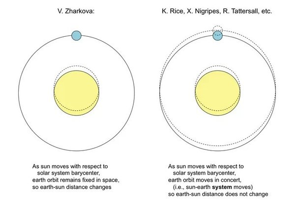

*Réponse publiée [sur Quora](https://fr.quora.com/Pourquoi-un-journal-scientifique-majeur-a-t-il-r%C3%A9tract%C3%A9-une-%C3%A9tude-qui-concluait-que-le-r%C3%A9chauffement-du-climat-n-%C3%A9tait-pas-d%C3%BB-aux-activit%C3%A9s-humaines-mais-au-soleil/answer/Dr-Goulu)*

Si c'est de [RETRACTED ARTICLE: Oscillations of the baseline of solar magnetic field and solar irradiance on a millennial timescale](https://www.nature.com/articles/s41598-019-45584-3) que vous parlez, alors c'est très simple : il est tellement faux que ce qui est incompréhensible est qu'il ait été accepté.

Notamment, Valentina Zharkova calcule la distance Terre-Soleil en considérant que la Terre tourne autour du centre du Soleil même lorsque celui-ci se déplace par rapport au centre de gravité du système solaire sous l'influence principale de Jupiter, alors que les planètes orbitent évidemment toutes autour de ce centre de gravité. Ca génère une erreur de 3 millions de km dont elle dérive le réchauffement actuel

( source et explications : [Paper That Blames The Sun For Climate Change Was Just Retracted From Major Journal](https://www.sciencealert.com/a-paper-that-blames-the-sun-for-climate-change-has-been-retracted) )

Mais si vous lisez l'article, vous verrez qu'elle ne dit pas que le réchauffement du climat n'est pas du aux activités humaines, elle dit qu'elle n'en a pas tenu compte. Nuance…

> These oscillations of the estimated terrestrial temperature do not include any human-induced factors, which were outside the scope of the current paper.

(dernière phrase de l'article)
