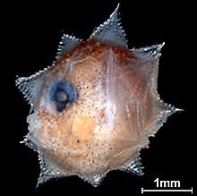

*Réponse publiée [sur Quora](https://fr.quora.com/Quelle-est-lespèce-animale-ayant-le-taux-de-survie-à-la-naissance-le-plus-faible/answer/Dr-Goulu)*

j’ai vérifié… certaines sources disent en une fois (wikipedia anglophone) d’autres en une saison de reproduction. Ils vivent jusqu’à 10 ans en captivité. Dans la nature, c’est statistiquement 1 an/ 300′000′000 = un dixième de seconde …

Voilà une larve déjà bien développée :

