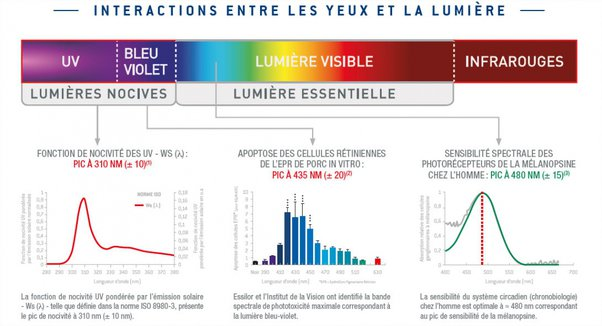
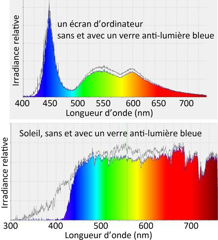
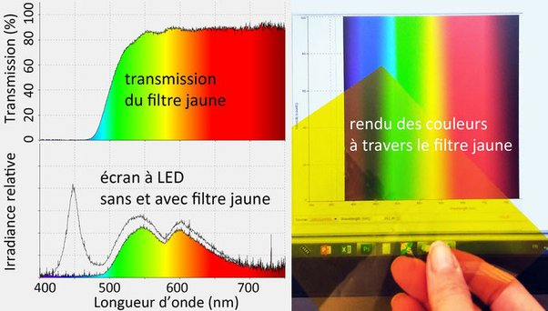

*Réponse publiée [sur Quora](https://fr.quora.com/Est-ce-que-les-lunettes-de-soleil-r%C3%A9guli%C3%A8res-peuvent-bloquer-la-lumi%C3%A8re-bleu-provenant-des-%C3%A9crans/answer/Dr-Goulu)*

En principe pas. Les lunettes de soleil bloquent les UVA et UVB qui sont "vraiment" dangereux

(source [[1]](#FsFwM) très intéressante surtout la fin)

La [Lumière bleue](w:) est dans le domaine du visible, et sa nocivité à long terme n'est pas encore formellement établie, mais de bonnes lunettes solaires ne la filtrent pas.

Comme on le voit dans [Test de lunettes anti-lumière bleue](https://www.123couleurs.fr/articles/lumièrebleue/) , très bien fait, les "lunettes anti lumière bleue" sont très peu efficaces devant un écran:

> Nous avons mesuré à l’aide de notre spectromètre la lumière émise par une zone blanche d’un écran d’ordinateur, sans et derrière un verre de lunette anti-lumière bleue. Et surprise (ou pas), le pic de lumière bleue n’est presque pas modifié.
>
>
>
> Seul le pied du pic du côté des courtes longueurs d’onde est significativement affecté et le maximum du pic est réduit seulement d'environ 10 % : **une baisse de 10 % de la luminosité de l’écran aurait le même effet**.
>
>
>
> 
>
>
>
> En revanche sur une source de lumière bleue comme le Soleil, beaucoup plus riche en très courtes longueurs d’onde, on voit clairement que notre verre anti-lumière bleue réduit très efficacement les longueurs d’onde en dessous de 430 nm environ, jusque dans l’UV.

De bonnes lunettes "anti lumière bleue" sont les "filtres jaunes", mais alors les couleurs sont faussées :

Notes de bas de page

[[1]](#cite-FsFwM)[UV et lumière bleue | Essilor France](https://www.essilor.fr/la-vue/lumiere/uv-et-lumiere-bleue)
