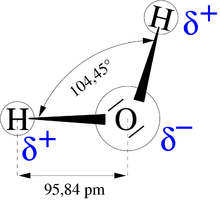

*Réponse publiée [sur Quora](https://fr.quora.com/Pourquoi-leau-est-elle-une-mol%C3%A9cule-extraordinaire/answer/Dr-Goulu)*

A cause des 104°.45

> Une propriété très importante de l’eau est sa nature [polaire](w:Polarité_(chimie)). La [molécule](w:) d’eau forme un angle de 104,45° au niveau de l’[atome](w:) d’[oxygène](w:) entre les deux liaisons avec les atomes d’[hydrogène](w:). Puisque l’oxygène a une [électronégativité](w:) plus forte que l’hydrogène, l’atome d’oxygène a une [charge partielle](w:) négative δ-, alors que les atomes d’hydrogène ont une charge partielle positive δ+.
>
>
>
> Une molécule avec une telle différence de charge est appelée un [dipôle](w:Dipôle_électrostatique) (molécule polaire). Ainsi, l’eau a un moment dipolaire de 1,83 [debye](w:Debye_(unité)). Cette polarité fait que les molécules d’eau s’attirent les unes les autres, le côté positif de l’une attirant le côté négatif d’une autre. Un tel lien électrique entre deux molécules s’appelle une [liaison hydrogène](w:).
>
>
>
> Cette polarisation permet aussi à la molécule d’eau de dissoudre les corps ioniques, en particulier les sels, en entourant chaque ion d’une coque de molécules d’eau par un phénomène de [solvatation](w:).
>
>
>
> Cette force d’attraction, relativement faible par rapport aux [liaisons covalentes](w:Liaison_covalente) de la molécule elle-même, explique certaines propriétés comme le [point d'ébullition](w:) élevé (quantité d’énergie calorifique nécessaire pour briser les liaisons hydrogène), ainsi qu’une [capacité thermique](w:) élevée.
>
>
>
> À cause des liaisons hydrogène également, la [densité](w:) de l’eau liquide est supérieure à la densité de la glace.
>
>
>
> ([Molécule d'eau — Wikipédia](w:Molécule_d'eau))
