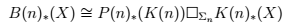

*Réponse publiée [sur Quora](https://fr.quora.com/Quelle-est-l-%C3%A9quation-que-vous-avez-du-mal-%C3%A0-r%C3%A9soudre-r%C3%A9cemment/answer/Dr-Goulu)*

Il m'y fallu plusieurs jours pour trouver de quoi causait cette formule gravée sur la tombe d'un ami de la famille, et la comprendre est définitivement hors de ma portée.

[L'abstraction mathématique gravée dans le marbre - Pourquoi Comment Combien](https://www.drgoulu.com/2016/12/02/abstraction-mathematique-gravee-dans-le-marbre/#.XnXFbIhsOCo)
