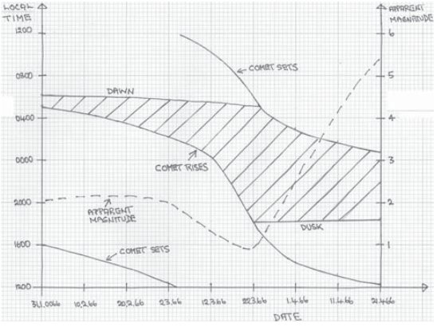

*Réponse publiée [sur Quora](https://fr.quora.com/Matthieu-2-9-parle-dune-étoile-qui-marchait-devant-les-mages-et-soudainement-sarrêta-où-le-petit-enfant-était-Ne-trouver-pas-cela-curieux-Quelles-réponses-donneriez-vous-à-cette/answer/Dr-Goulu)*

Bonjour. Pour Hérode vous avez raison, il ne l'a pas vue mais a demandé aux mages depuis quand elle brillait ( [Matthieu 2:7 Alors Hérode fit appeler en secret les mages, et s'enquit soigneusement auprès d'eux depuis combien de temps l'étoile brillait.](https://saintebible.com/matthew/2-7.htm))

Sur les autres points, mes sources sont dans les liens mentionnés, en particulier [Étoile de Bethléem — Wikipédia](w:Étoile_de_Bethléem) qui dit :

" les sources historiques les plus précises sont les observations des astronomes chinois. La [comète de Halley](w:1P/Halley), mais pas très spectaculaire vu de la Judée, était de passage en 12 av. J.-C. (et également en 66 apr. J.-C., où elle a peut-être joué un rôle dans l'écriture du texte de Matthieu, voir ci-dessous), deux autres comètes (décrites comme étoiles poilues) ont été enregistrées par les Chinois et Coréens et 5 et 4 av. J.-C.. Dans toutes les anciennes civilisations l'arrivée d'une comète était un présage de mauvais augure et signe démoniaque. Il est difficile de réconcilier cette notion avec la naissance du [Messie](w:). Cependant, Humphreys a trouvé quelques exemples où des comètes était considérées comme apportant de bonnes nouvelles et il a suggéré que l'étoile était une comète observée par les chinois en 5 av. J.-C."

Il n'y a hélas pas de référence à la phrase selon laquelle Haley n'était "pas très spectaculaire" depuis la Judée mais dans l'article mentionné il y a ce graphique pour celle de 66 :

donc il est tout à fait possible de faire le même pour celle de 12, et une différence de quelques heures de décalage entre la Chine et Jérusalem peut parfaitement justifier qu'elle était visible d'un endroit et pas d'un autre.

Cependant, on estime que la [Date de naissance de Jésus](w:) (très difficile à déterminer tant les évangiles ne coincident pas avec les faits historiques…) est comprise entre -6 et +4. Si il y a eu une "étoile" transitoire visible à cette période, c'est une comète documentée par les chinois en -5 ou en -4.
