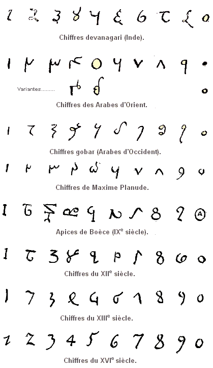

*Réponse publiée [sur Quora](https://fr.quora.com/Quels-sont-exactement-les-chiffres/answer/Dr-Goulu)*

> Un [Chiffre](w:) est un [signe d'écriture](w:Signe_(écriture)) utilisé seul ou en combinaison pour représenter des [nombres entiers](w:Entier_naturel).
>
>
>
> Dans un [système de numération](w:) [positionnel](w:Notation_positionnelle) comme le [système décimal](w:), un petit nombre de chiffres suffit pour exprimer n'importe quelle valeur. Le nombre de chiffres du système est la base.
>
>
>
> Le [système décimal](w:), le plus courant des systèmes de numération, comporte dix chiffres représentant les nombres de zéro à neuf.
>
>
>
> (wikipedia)

