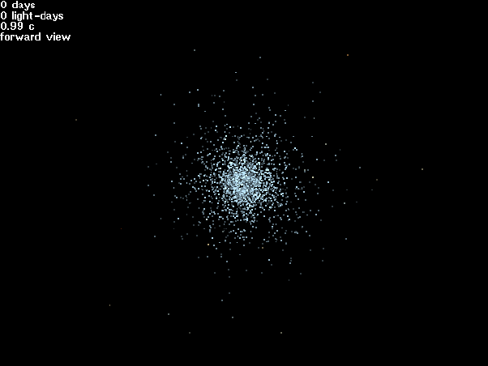

*Réponse publiée [sur Quora](https://fr.quora.com/Supposons-que-nous-ayons-la-technologie-suffisante-pour-nous-déplacer-à-la-vitesse-de-la-lumière-avec-une-accélération-progressive-lhomme-pourrait-il-survivre-à-une-telle-vitesse/answer/Dr-Goulu)*

Oui, et pas que les étoiles en face du vaisseau : à la vitesse de la lumière toutes les étoiles du ciel semblent venir d'un point en face du vaisseau…

A 99% de c ça donne ça (source : [Relativistic Starflight](https://hexadecimal.uoregon.edu/relativity/) )

Je me rappelle avoir vu un film mais je sais plus où…

Je pense qu'on devrait aussi voir une sorte halo des sources radio qui devraient devenir visible, et à une certaine vitesse le CMB…

Mais bon, avec un bon blindage on devrait éviter les X … et abandonner tout espoir de voir un obstacle dans la direction du voyage …
