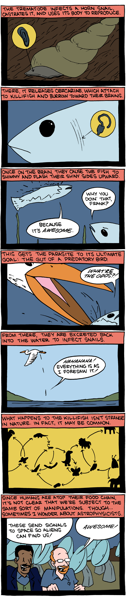

*Réponse publiée [sur Quora](https://fr.quora.com/Pensez-vous-quun-virus-ou-autre-peut-rendre-les-humains-agressifs-et-d%C3%A9pourvus-dhumanit%C3%A9-comme-des-zombies/answer/Dr-Goulu)*

Absolument, ça existe, ça s'appelle la [Rage](w:Rage_(maladie)).

On oublie un peu trop souvent cette maladie qui fait pourtant encore 60'000 morts horribles par an dans le monde. Elle est mortelle à 100% moins une poignée de cas quasi miraculeux.

Cette saleté de [Virus de la rage](w:) attaque le système limbique ce qui rend l'hôte agressif, et infecte ses glandes salivaires "pour" se transmettre par morsure. Il infecte donc surtout des carnivores, comme le "meilleur ami de l'homme" responsable de 98% des transmissions à l'homme et contre lequel tous les voyageurs jusqu'à Pasteur devaient se prémunir à l'aide d'un solide bâton.

Pour les fourmis, il y a [Ophiocordyceps unilateralis](w:), un champignon qui prend le contrôle du cerveau des fourmis, leur fait chercher un terrain favorable pour lui, les faire grimper au sommer d'une tige, la mordre pour ne pas tomber, et là il leur fait exploser la tête pour disséminer ses spores. Sympa pour un film d'horreur, non ?

Sinon, il y a [Toxoplasma gondii](w:), qui a un effet très étrange sur les souris : elles n'ont plus peur des chats, et seraient même attirées par eux "pour" mieux se faire bouffer, se transmettre au chat, qui contamine des plantes par ses déjections, et retour aux souris etc.

Là où ça devient intéressant, c'est quand on voit que les chimpanzés contaminés par la toxoplasmose ont moins peur des léopards, et que certaines études semblent montrer que les humains contaminés ont plus d'accidents que la moyenne, comme s'ils devenaient un peu moins prudents, vous voyez ?

[Euhaplorchis californiensis](w:en:Euhaplorchis_californiensis), un parasite qui fait nager les poissons le ventre à l'air "pour" que les oiseaux les bouffent a inspiré à "Saturday Morning Breakfast Cereal” cette idée géniale:

Et si les Aliens nous avaient contaminé avec un parasite qui nous pousse à leur signaler notre position ?

[Quel trématode a infecté METI ? - Pourquoi Comment Combien](/2011/08/28/quel-trematode-a-infecte-meti/#.XoRMPqiiGCo)
