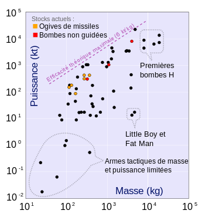

*Réponse publiée [sur Quora](https://fr.quora.com/Que-pensent-les-physiciens-dune-bombe-anti-matière/answer/Dr-Goulu)*

attention : là on parle d'un gramme d'antimatière, alors que A ou H pèsent quand même au moins 100 kg dont quelques kilos de "combustible"

sur le graphique de [Puissance des armes nucléaires — Wikipédia](w:Puissance_des_armes_nucléaires)

on serait sur l'axe vertical, voir même à gauche …
