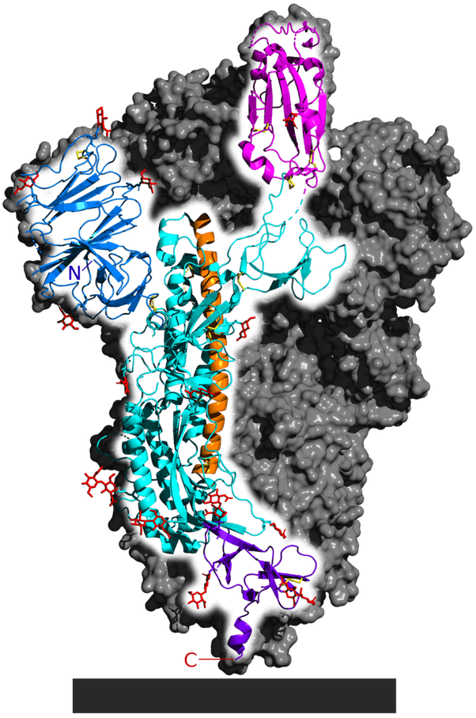

*Réponse publiée [sur Quora](https://fr.quora.com/Quelle-est-la-structure-chimique-de-COVID-19/answer/Dr-Goulu)*

[Covid-19](w:Maladie_à_coronavirus_2019) est une maladie, elle n'a pas de structure chimique. Le D de CoviD signifie Disease = maladie.

Le virus responsable est le [SARS-CoV-2](w:Coronavirus_2_du_syndrome_respiratoire_aigu_sévère) dont la [structure protéitique](w:Coronavirus_2_du_syndrome_respiratoire_aigu_sévère) est la suivante: (copié/collé de la Wikipédia) :

> Comme d'autres [coronavirus](w:), le SARS-CoV-2 possède quatre protéines structurales :
>
>
>
> 1. **protéines S** (dites *protéine spike* ou *protéine de pointe*) : Elles forment les protubérances de la « couronne », présumée essentielles pour lier le virus à un (ou plusieurs) récepteurs(s) en surface d'une cellule (après activation par une autre protéines de la membrane cellulaire).
> Ces protéines semblent être l'un des principaux déterminants du [tropisme](w:) viral (« le tropisme d’un virus se définit comme l’ensemble des cellules cibles et permissives à ce virus. Le connaître permet de déterminer le ou les organes cibles, ainsi que la ou les espèces animales pouvant être infectées » ; Les virus à ARN mutent facilement ; quand une mutation permet au virus de changer son tropisme, il peut, soit franchir la barrière des espèces et infecter un nouvel hôte (humain, porc par exemple), soit cibler un autre organe (péritonite infectieuse fatale du chat et du furet par exemple, avec un autre coronavirus). La publication du génome viral a permis de la [modéliser](w:Modélisation_de_protéines_par_enfilage) (voir ci-contre).
> Elle a aussi été décrite au niveau atomique par la [microscopie électronique cryogénique](https://fr.wikipedia.org/w/index.php?title=Microscopie_électronique_cryogénique&action=edit&redlink=1).
> Elle semble plus efficace que celle du SARS-CoV (affinité plus élevée pour l'[ACE2](w:) humain, un homologue de l'ACE), ce qui expliquerait pourquoi la Covid-19 se répand beaucoup plus vite que le SRAS Un segment de cette protéine *spike* semble caractéristique du SARS-CoV-2.
> 2. **protéine E** (enveloppe) ;
> 3. **protéine M** (membrane) ;
> 4. **protéine N** ([nucléocapside](w:)) ; c'est elle qui enveloppe et protège l'ARN viral (le code génétique du virus).
>
>
>
> Les protéines S, E et M constituent, ensemble, l'enveloppe virale.
>
>
>
> Outre un segment de la protéine S (Spike), un court gène supplémentaire semble également spécifique à ce virus (segment dont la réalité biologique et le rôle éventuel étaient fin janvier encore à démontrer*).*

on y trouve ce dessin de la

> [Glycoprotéine](w:) de pointe du SARS-CoV-2. PDB: 6VSB. La [protéine](w:) entière est un homo[trimère](w:), dont seul [monomère](w:) est ici mis en évidence, le reste du trimère étant représenté en gris.
> Certaines parties de la structure réelle ne sont pas représentées.
> Sont représentés les domaines protéiques N-terminal (lettre N) à C-terminal (C) :
>
>
>
> Domaine N-terminal (bleu) ; domaine de liaison au [récepteur ACE2](w:ACE2) (magenta) ; structure générale (cyan), hélice centrale (orange) ; le domaine du connecteur qui ancre la protéine de pointe à l'enveloppe lipidique du virus (violet). Les [liaisons disulfure](w:Liaison_disulfure) sont en Jaune, et les [glucides](w:Glucide) en Rouge. Le gris présente la membrane lipidique du virus.

Voilà, avec ça vous devriez être capable de nous faire un vaccin …
