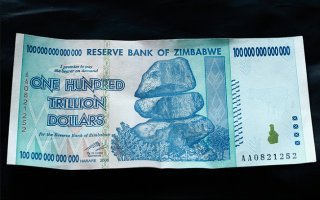

*Réponse publiée [sur Quora](https://fr.quora.com/20-vaut-t-il-vraiment-20-Et-pourquoi-100-peut-valoir-aussi-ch%C3%A8re-que-10-alors-que-seule-la-grandeur-change/answer/Dr-Goulu)*

Je ne comprends pas ce que vous voulez dire par "pourquoi 100€ peut valoir aussi cher que 10€". Vous parlez du prix de production des billets ? On ne le sait pas officiellement[[1]](#gNjkt), mais il doit être autour de 1 Euro. Un billet de banque, c'est juste du papier imprimé, de très haute qualité, mais ça ne dépend pas du chiffre imprimé sur le billet.

Après, pourquoi un billet de 20 vaut 20 et un billet de 100 vaut 100, c'est juste que vous le voulez bien. C'est vous qui avez assez confiance dans votre monnaie pour accepter du papier imprimé en échange d'un mois de travail, parce que vous êtes assez confiant que votre épicier va accepter de vous donner à manger en échange du papier imprimé.

Si vous perdez cette confiance, vous direz à votre patron de vous payer directement en bouffe, ou en or, ou en n'importe quoi en quoi vous avez confiance. Mais si tout le monde perd confiance dans la monnaie, elle ne vaudra plus rien. Votre gouvernement imprimera des billets comme celui ci :

qui suffira tout juste pour payer un sandwich .

La valeur d'une monnaie, c'est de la confiance pure.

Notes de bas de page

[[1]](#cite-gNjkt)[Combien coûte la fabrication de la monnaie et qui paye ?](https://www.nouvelobs.com/rue89/rue89-economie/20100215.RUE4588/combien-coute-la-fabrication-de-la-monnaie-et-qui-paye.html)
