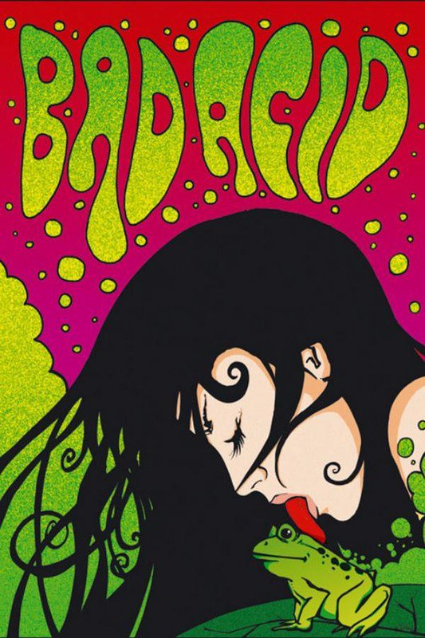

*Réponse publiée [sur Quora](https://fr.quora.com/D-o%C3%B9-vient-le-mythe-que-si-l-on-embrasse-un-crapaud-celui-ci-se-transforme-en-prince-charmant/answer/Dr-Goulu)*

J'ai une hypothèse audacieuse et originale. Celle-là :

[Rhinella marina](w:) et d'autres espèces de crapauds sécrètent des substances hallucinogènes et toxiques par la peau. Certains les élèvent à des fins récréatives…

Est-ce qu'une telle expérience aurait provoqué la naissance d'un conte de fée ? Ca ne serait pas la première fois …

Pour plus d'infos sur les étonnantes pratiques de nos amis les hommes en quête de paradis "artificiels" 100% naturels, je recommande l'écoute d'une émission incroyable disponible en MP3 là :

[Il faut s'abstenir de faire le moindre léchage de crapaud ! - Pourquoi Comment Combien](https://www.drgoulu.com/2007/09/28/il-faut-sabstenir-de-faire-le-moindre-lechage-de-crapaud/#.XqKASmiiGCo)
