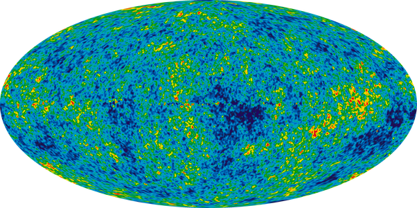

*Réponse publiée [sur Quora](https://fr.quora.com/Pourquoi-ne-voit-on-pas-de-photons-du-Big-Bang-alors-quon-reçoit-des-neutrinos-du-Big-Bang-et-que-les-deux-vont-à-la-même-vitesse-à-peu-près/answer/Dr-Goulu)*

celle là ?

oui [Fond diffus cosmologique](w:) = photons. Très froids, donc plutôt des ondes radio (centimétriques) que de la lumière, mais photons quand même.
