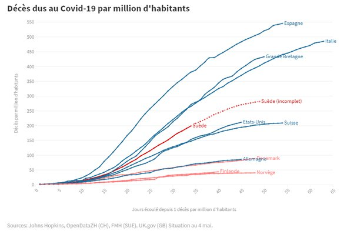

*Réponse publiée [sur Quora](https://fr.quora.com/Si-le-coronavirus-est-si-mortel-pourquoi-la-Su%C3%A8de-a-t-elle-pu-le-traiter-en-nintroduisant-pas-r%C3%A9ellement-des-r%C3%A8gles-plus-strictes/answer/Dr-Goulu)*

En fait la Suède a un taux de mortalité nettement supérieur à ses voisins (Danemark, Finlande, Norvège) :

Leur pari est que sur la durée, ils auront moins de décès, et surtout moins d'effets négatifs du confinement. Anders Tegnell, l'épidémiologiste en chef de l'Agence de santé suédoise a dit:

> Je ne sais pas si quiconque aura raison à long terme. Des gens meurent partout, c’est une catastrophe mondiale. Nous essayons de limiter les dégâts autant que possible, tout en faisant en sorte que la société fonctionne.
>
>
>
> (…)
>
>
>
> Si on ferme la société, il y a des effets secondaires comme le chômage qui ont aussi une incidence sur la santé. C'est ce que nous essayons d'éviter

( source : [L'approche suédoise face au Covid-19, un choix assumé au bilan discuté](https://www.rts.ch/info/monde/11300754-l-approche-suedoise-face-au-covid-19-un-choix-assume-au-bilan-discute.html) )

On verra dans quelques mois, voire années quelle stratégie était la meilleure.
