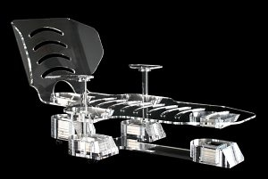

*Réponse publiée [sur Quora](https://fr.quora.com/Comment-est-il-que-nous-ne-puissions-défier-la-loi-de-la-gravité/answer/Dr-Goulu)*

Ah ben si vous connaissez la solution, pourquoi poser la question ?

Oui la répulsion magnétique est aussi plus forte que la gravité, je la mentionne dans ma réponse, il y a plein de bidules qui l'utilisent, même des chaises

