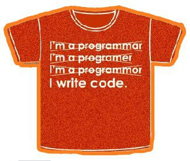

*Réponse publiée [sur Quora](https://fr.quora.com/Quel-processus-%C3%A9tape-par-%C3%A9tape-recommanderiez-vous-%C3%A0-un-d%C3%A9butant-qui-voudrait-apprendre-le-d%C3%A9veloppement-mobile-et-web-full-stack/answer/Dr-Goulu)*

Suivez la carte : [The 2019 Web Developer Roadmap - A Visual Guide to Becoming a Front End, Back End, or DevOps Developer](https://www.freecodecamp.org/news/2019-web-developer-roadmap/)

sérieusement : il y a trop. Vous devez faire des choix, souvent imposés par les projets sur lesquels vous travaillez.

Prenez un projet GitHub que vous trouvez intéressant, installez tout ce qu'il faut pour le builder+tester, et essayez d'y contribuer.

C'est en forgeant qu'on devient forgeron, c'est en codant qu'on devient …

