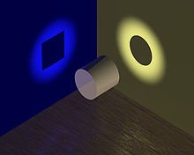

*Réponse publiée [sur Quora](https://fr.quora.com/Pourquoi-veut-on-absolument-appliquer-la-relativité-de-Galilée-à-la-lumiere-qui-na-pas-de-masse/answer/Dr-Goulu)*

ouaip mais au bout du compte on parle d'un même truc

[Dualité onde-corpuscule — Wikipédia](w:Dualité_onde-corpuscule)
