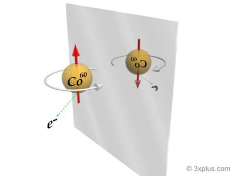

*Réponse publiée [sur Quora](https://fr.quora.com/Quest-ce-quune-violation-de-CP-en-physique/answer/Dr-Goulu)*

Pas d'accord avec [Brice Haziza](https://fr.quora.com/profile/Brice-Haziza) pour une fois : la violation de la symétrie CP a été une énorme surprise pour les théoriciens. Jusqu'en 1964, on pensait que la [Symétrie CP](w:) était parfaite, c'est une expérience qui a montré que ce n'était pas le cas.

Pour comprendre, il faut commencer par la [Symétrie P](w:Parité_(physique)) comme "parité" qui pose la question toute simple "est-ce que la physique vue dans un miroir est toujours valable ?" Ou autrement dit : "est-ce qu'en voyant le film d'une expérience de physique , je peux dire qu'il a été pris dans un miroir ?"

Jusqu'en 1956, on pensait que non, on peut pas le dire, donc oui, la physique "dans un miroir" est tout à fait normale.

Mais en 1956, [Chien-Shiung Wu](w:) s'est aperçue que la désintégration du Cobalt 60 (radioactif) émet un électron dans la direction opposée au spin de l'atome un millionième de fois plus souvent que dans la direction du spin.

Autrement dit, en regardant cette expérience dans un miroir, on verrait l'électron partir plus souvent dans la direction du spin, et on saurait que c'est vu dans un miroir :

Sauf que si on combine le miroir (Symétrie P) avec la [Symétrie C](w:) qui correspond à une inversion des charges électriques, autrement dit l'antimatière, alors la symétrie CP est conservée : la physique est la même si on regarde de l'antimatière dans un miroir que de la matière "normale" directement.

Sauf que justement, en 1964, on s'est aperçus que la transformation d’un kaon en antikaon est 1 milliardième de fois plus rare que la transformation d’un antikaon en kaon. Donc la symétrie CP n'est pas parfaite, cette expérience est une "**violation de la symétrie CP**". Et c'est l'une des explications possibles à l'existence de plus de matière que d'antimatière, donc vachement important : j'existe !

A moins que le film de l'antimatière dans un miroir passe à l'envers… En fait la [Symétrie CPT](w:) est considérée comme parfaite, elle. Et là on a réussi à raccrocher les théoriciens, qui ont pondu et démontré le "théorème CPT" :

> toute [théorie quantique des champs](w:) locale [invariante au sens de Lorentz](w:Invariance_de_Lorentz) avec un [hamiltonien](w:Opérateur_hamiltonien) [hermitien](w:) doit posséder une symétrie CPT.

Ce truc est l'un des très rares ponts théoriques entre la mécanique quantique et la théorie de la relativité (via l' [Invariance de Lorentz](w:) ), pour ne pas dire le seul (?)

Reste qu'il m'est toujours totalement impossible de comprendre comment trois notions aussi distinctes que la géométrie, l'antimatière et la direction du temps peuvent être aussi intimement liées… (au secours [Hadrien Chevalier](https://fr.quora.com/profile/Hadrien-Chevalier) , vous êtes mon seul espoir…)

Tous les détails dans [MIROIR | ЯIOЯIM - Pourquoi Comment Combien](/2009/04/04/miroir/) , le meilleur article de blog de ma vie …
