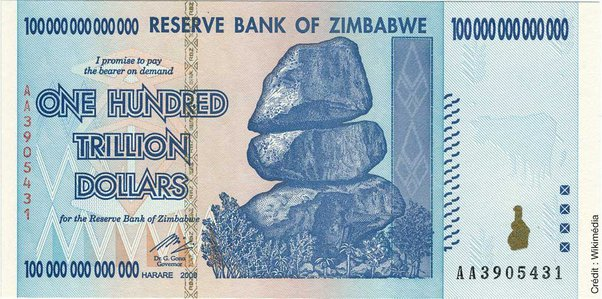
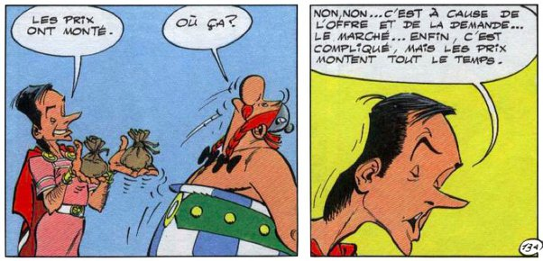

*Réponse publiée [sur Quora](https://fr.quora.com/S-il-existait-une-ville-o%C3%B9-ne-vivaient-que-des-milliardaires-combien-co%C3%BBterait-une-baguette-de-pain/answer/Dr-Goulu)*

Il était une fois un pays entier peuplé de milliardaires : le Zimbabwe.

En 2009, la banque centrale y a imprimé des [billets de cent mille milliards de dollars zimbabweens](https://www.lemonde.fr/afrique/article/2009/01/16/un-billet-de-cent-mille-milliards-de-dollars-au-zimbabwe_1142680_3212.html) :

Au moment de leur émission, ça valait environ 35 dollars US. Une semaine plus tard, ça ne valait plus que 3.5 dollars… Avec une telle inflation, le type qui recevait un billet courait au magasin acheter n'importe quoi avec, de préférence quelque chose à manger.

Pour revenir à votre question, toute l'économie est gérée par une seule loi : l'offre et la demande, magnifiquement expliquée dans "Obelix et compagnie" :

Donc si vos milliardaires ont autre chose à bouffer, ou peuvent aller acheter du pain dans la ville d'à côté, leur boulanger ne pourra pas trop augmenter ses prix.

Si ils n'ont pas le choix et doivent choisir entre la baguette locale ou la mort de faim, le boulanger va devenir multimilliardaire, comme au Zimbabwe.
