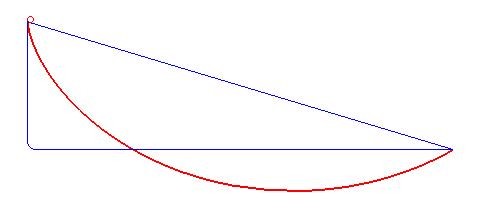

*Réponse publiée [sur Quora](https://fr.quora.com/Quelle-serait-la-forme-optimale-pour-un-toboggan-de-hauteur-H-et-de-longueur-au-sol-L-afin-de-minimiser-la-vitesse-terminale-sachant-que-le-toboggan-ne-doit-pas-faire-de-zigzag-courbe-monotone/answer/Evelyn-90)*

C'est la [Courbe brachistochrone — Wikipédia](w:Courbe_brachistochrone)
