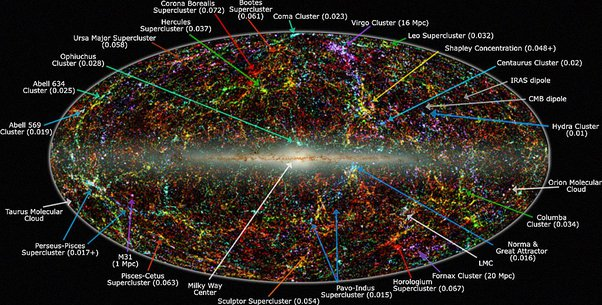

*Réponse publiée [sur Quora](https://fr.quora.com/Comment-pouvons-nous-démontrer-que-l-univers-est-infini/answer/Dr-Goulu)*

L'anisotropie vaut 1/10'000 K sur 2.73… C'est pas beaucoup, mais effectivement, c'est peut-être un signe de quelque chose ( [L'Anisotropie du Fond Diffus Cosmologique](http://www.ca-se-passe-la-haut.fr/2013/09/lanisotropie-du-fond-diffus-cosmologique.html) )

Et effectivement la [Structures à grande échelle de l'Univers](w:) fait apparaître des filaments d'amas de galaxies, peut-être produits par les "grumeaux" du CMB, mais quand on regarde ça, les structures ne sautent pas aux yeux :

