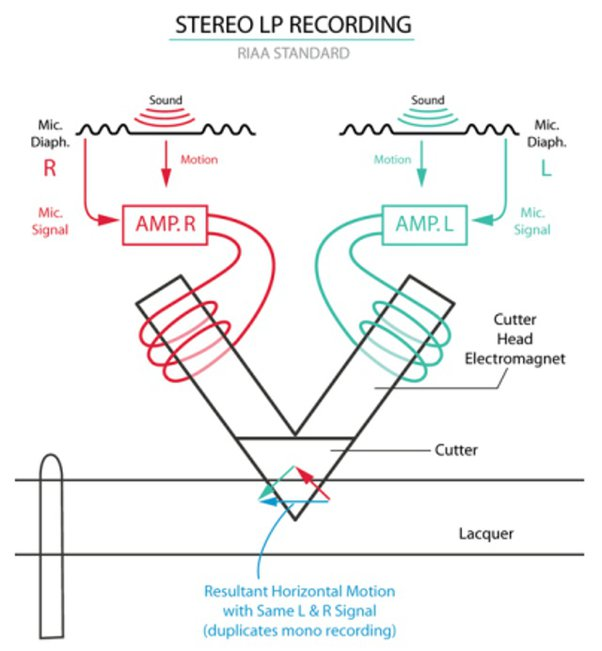

*Réponse publiée [sur Quora](https://fr.quora.com/Comment-obtenez-vous-le-son-st%C3%A9r%C3%A9o-dun-disque-vinyle/answer/Dr-Goulu)*

[Disque microsillon — Wikipédia](w:Disque_microsillon) :

> À partir de 1958, les disques [stéréophoniques](w:Son_stéréophonique) vinrent compléter l'amélioration du procédé. Ils exploitaient un principe de gravure mis au point dès 1931 par Alan Blumlein à la BBC, avec des disques 78 tours. **À la modulation latérale du disque monophonique s'ajoute une modulation verticale gravée en profondeur, représentant la différence entre le canal gauche et le canal droit.**
>
>
>
> Les lecteurs monophoniques pouvaient, de cette manière, lire la réduction monophonique en ne transcrivant que la vitesse latérale de l'aiguille et les disques stéréo portaient ainsi l'étiquette « mono-compatible » (pouvant être lus indifféremment avec une pointe mono ou stéréo). Inversement, les disques mono pouvaient être lus avec une pointe stéréo, les signaux étant identiques des deux côtés.

Le principe de l'enregistrement est représenté sur cette figure, pour la lecture c'est la même chose à l'envers:source

source et détails : [Découverte du disque vinyle : "dis, c’est comment un microsillon ?"](https://www.on-mag.fr/index.php/topaudio/actualites-news/14384-dis-c-est-comment-un-microsillon)
