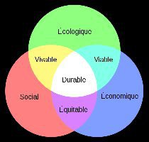

*Réponse publiée [sur Quora](https://fr.quora.com/Maintenant-que-lon-sait-que-l%C3%A9conomie-nest-pas-compatible-avec-l%C3%A9cologie-comment-fait-on-pour-la-suite/answer/Dr-Goulu)*

(Je ne vois pas le rapport entre le lien donné et votre question.)

Votre question oublie deux piliers du développement durable : le social (répartition de richesses, et la démographie. On représente ça habituellement ainsi :

Je pense que la démographie écarté les 3 cercles…

[D éveloppement Durable et Equation de Kaya - Pourquoi Comment Combien](https://www.drgoulu.com/2009/06/06/developpement-durable-et-equation-de-kaya/)

Pour la suite, ben on fonce dans le mur et la démographie suivra de gré ou de force. Vous vouliez proposer autre chose ? C'est trop tard.
