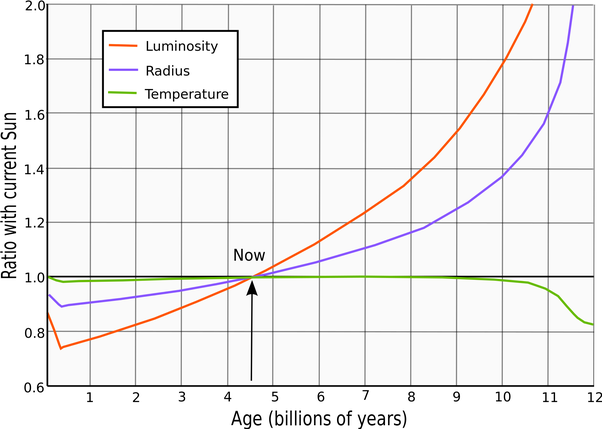

*Réponse publiée [sur Quora](https://fr.quora.com/Est-ce-que-si-lon-envoyait-des-objets-dans-le-soleil-cela-le-ferait-grossir/answer/Dr-Goulu)*

Qui "on" ? Qu'appelez-vous "grossir" ?

Le [Soleil](w:) convertit en énergie 4.3 millions de tonnes (environ la masse de la pyramide de Gizeh) par seconde, donc si "on" veut augmenter la masse du Soleil pendant quelques secondes, "on" peut y envoyer un gros astéroïde, à condition qu' "on" aie assez d'énergie, parce que ça demande plus d'énergie de faire tomber un truc sur le Soleil que de l'envoyer en dehors du système solaire.

Si "on" veut le faire grossir en taille, c'est beaucoup plus simple, il n'y a rien à faire du tout. En raison de son fonctionnement interne, le Soleil devient peu à peu plus gros et plus lumineux. D'après la figure ci-dessous, je calcule pifométriquement que si son rayon augmente de 10% en 2.5 milliards d'années, ça fait 4 milliardièmes d'augmentation par année, et comme son rayon vaut actuellement 696'340 km, il grossit de 2.78 m par année environ.

Petite remarque pour ceux qui croient que le réchauffement climatique pourrait être du à ça, la réponse est non. Vous aurez raison dans un milliard d'années quand les océans bouilliront, mais 100°C d'augmentation en un milliard d'années ça fait 0.00001° par siècle, pas 4. Et les variations de luminosité dues aux cycles solaires sont de 0.1%, le dixième de l'épaisseur du trait sur la figure …
