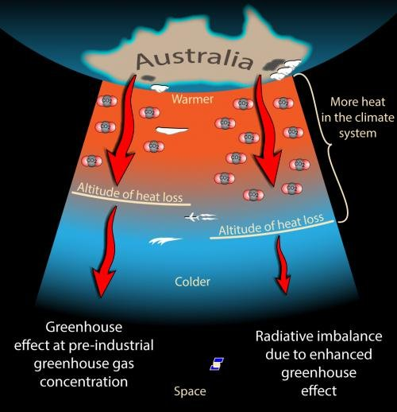

*Réponse publiée [sur Quora](https://fr.quora.com/Qui-peut-m-expliquer-pourquoi-la-capacit%C3%A9-d-absorption-des-rayons-infra-rouges-par-le-CO2-a-%C3%A9t%C3%A9-satur%C3%A9e/answer/Dr-Goulu)*

Le fameux [graphique qui vaut 10000 mots](https://www.drgoulu.com/2011/11/13/climat-le-graphique/#.XtDM_TqiGCo) de [Robert Rohde](w:en:Robert_Rohde) ci-dessous montre que dans les bandes de rayonnement que le CO2 absorbe, il absorbe déjà (presque) tout.

Mais contrairement aux idées simplistes de [Jerome Gontier](https://fr.quora.com/profile/Jerome-Gontier) et autres climatosceptiques, ceci n'empêche pas le [Forçage radiatif](w:)d'augmenter si on émet plus de CO2, mais le mécanisme est plus subtil.

C'est expliqué assez simplement sur [Effet de serre et réchauffement climatique](https://global-climat.com/effet-de-serre-et-rechauffement-climatique/) sur global-climat.com:

> Au fur et à mesure que le rayonnement infrarouge s’élève couche par couche dans l’atmosphère, le dioxyde de carbone, la vapeur d’eau ou d’autres gaz à effet de serre absorbent un peu d’énergie. Chaque couche d’air rayonne une partie de l’énergie qu’elle a absorbée vers le sol et une partie vers les couches supérieures. Plus haut, l’atmosphère devient de plus en plus mince. Finalement, l’énergie atteint une couche si mince que le rayonnement peut s’échapper vers l’espace.
>
>
>
> Si l’on ajoute du CO2 dans l’atmosphère, l’endroit à partir duquel la plus grande partie de l’énergie thermique qui quitte finalement la Terre se déplacera vers les couches supérieures. Comme les niveaux plus élevés rayonnent une partie de l’excès vers le bas, tous les niveaux inférieurs jusqu’à la surface se réchauffent.

(source [https://www.skepticalscience.com...](https://www.skepticalscience.com/saturated-co2-effect.htm) )

L'origine de l'argument climatosceptique sur la saturation du CO2 est un article d'un certain [Ferenc Miskolczi, qui a été réfuté de multiples manières](http://www.realclimate.org/wiki/index.php?title=Ferenc_Miskolczi) depuis.
