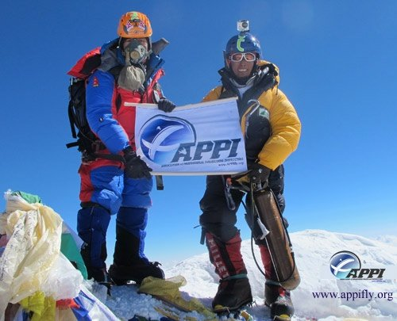

*Réponse publiée [sur Quora](https://fr.quora.com/Quelles-images-montrent-l-%C3%A9volution-de-l-homme/answer/Dr-Goulu)*

Un sherpa (à droite) et son client (à gauche) au sommet de l'Everest. Le sherpa a donné sa bouteille d'oxygène au client 900m plus bas.

Le sherpa a les gènes [EGLN1](http://www.wikipedia.org/search-redirect.php?language=en&go=Go&search=EGLN1) et [EPAS1](http://www.wikipedia.org/search-redirect.php?language=en&go=Go&search=EPAS1) modifiés par [L'adaptation à l'altitude](https://www.drgoulu.com/2014/08/17/ladaptation-a-laltitude/).
