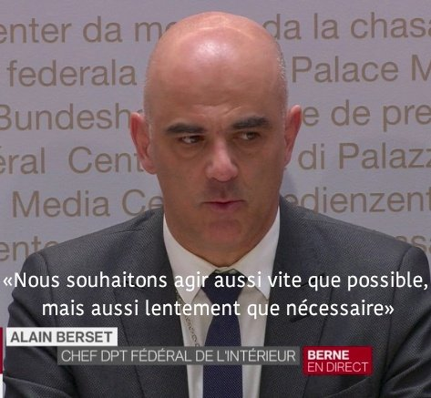

*Réponse publiée [sur Quora](https://fr.quora.com/Comment-attribuer-au-hasard-le-film-Another-Earth-sorti-en-salle-le-22-juillet-2011-racontant-lapparition-dans-le-ciel-dune-planète-identique-à-la-notre-et-la-découverte-par-la-NASA-le-21-juillet-2015/answer/Dr-Goulu)*

Arrêtez de faire des grands mix de n'importe quoi et concentrez-vous sur une question à la fois. En sciences lorsqu'on affirme (ou sous-entend) quelque chose, on doit l'appuyer par des sources, ce qui signifie en gros "si ces gars là se sont trompés ou ont menti ou triché, mon propre travail ci-joint ne vaut pas tripette". Donc les sources, sexy ou pas sont INDISPENSABLES pour construire l'arbre de la connaissance. L'article du Lancet décrédibilise (un peu) ce journal, mais il ne fait pas de mal tant que personne ne le référence pour construire sa propre recherche dessus.

Mais ce n'est pas parce que P implique Q que non P implique non Q : il ne suffit pas de dire "ouais, j'ai entendu dire l'autre jour que peut-être la NASA cache des documents, donc tout ce qu'on nous dit sur l'espace est fake." Ca c'est du Trumpisme. Ou du journalisme d'opinion (je suis Suisse donc votre couverture de journal ne m'inspire rien du tout. Nous on a un ministre qui a sorti une phrase d'anthologie, j'ai acheté le T-shirt:

Mais en sciences, qui reste, même si elle n'est pas parfaite, la meilleure méthode d'approcher progressivement la réalité, les sources sont INDISPENSABLES. Pas de sources = pas de sciences = pas de connaissance.
