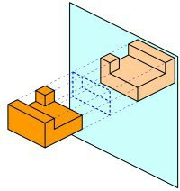

*Réponse publiée [sur Quora](https://fr.quora.com/Pourquoi-quand-on-regarde-dans-le-miroir-tout-est-invers%C3%A9/answer/Dr-Goulu)*

La symétrie correspond à une inversion de la profondeur, la direction perpendiculaire au miroir. Si vous tendez le bras vers le miroir, votre main est le plus loin de vous, mais semble le plus près de vous dans le miroir :

Le miroir vous "retourne comme un gant" : un gant droit retourné devient un gant gauche.

[MIROIR | ЯIOЯIM - Pourquoi Comment Combien](https://www.drgoulu.com/2009/04/04/miroir/)
